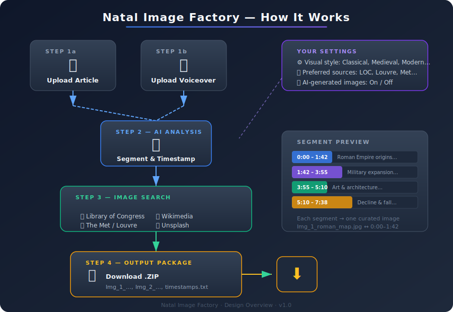

# Natal Image Factory — Design Overview

**Prepared for client review · v1.0**

---

## What Is Natal Image Factory?

Natal Image Factory is a web application designed for writers and podcasters who want to turn their written articles and voiceover recordings into visually rich videos — without the tedious work of manually searching for images and aligning them to audio.

You upload your **article text** and your **voiceover audio**. The application does the rest: it breaks your narration into natural thematic segments, finds compelling public-domain images for each segment, and delivers a neatly packaged download ready for your video editor.

---

## How It Works — At a Glance



The process follows four simple steps:

### Step 1 — Upload Your Content

- **Article text** — paste or upload the written article (plain text, Markdown, or Word document).
- **Voiceover audio** — upload the recorded narration (MP3, WAV, or other common audio formats).

Both uploads happen through a clean, straightforward web interface.

### Step 2 — Intelligent Segmentation

The application uses AI to read through your article and listen to your voiceover, then divides the narration into **semantic segments** — natural topic boundaries where the subject shifts (e.g., from "the founding of Rome" to "military campaigns"). Each segment is assigned a precise **start and end timestamp** tied to the audio.

Think of it as the application creating an outline of your narration, with each bullet point getting its own illustration.

### Step 3 — Curated Image Search

For each segment, the application searches trusted public-domain and open-source image collections for a single, well-matched illustration. Sources include (but are not limited to):

| Source | What You'll Find |
|---|---|
| **Library of Congress** | Historic photographs, maps, posters, prints |
| **Wikimedia Commons** | Paintings, diagrams, charts, lithographs |
| **The Metropolitan Museum of Art** | Classical and fine-art imagery |
| **The Louvre (Collections)** | European paintings and antiquities |
| **Smithsonian Open Access** | Science, history, culture imagery |
| **Unsplash** | High-quality modern photography |
| **Europeana** | European cultural heritage |
| **AI Generation (optional)** | Custom illustrations when no suitable public-domain image exists |

You can **add or prioritize your own preferred sources** in the settings, and the application maintains its own curated default list that evolves over time.

### Step 4 — Download Your Package

The application delivers a single **.zip file** containing:

1. **Numbered images** — named sequentially for easy import into any video editor:
   ```
   Img_01_roman_map.jpg
   Img_02_legion_formation.jpg
   Img_03_colosseum_lithograph.jpg
   Img_04_fall_of_rome.jpg
   ...
   ```

2. **Timestamps file** (`timestamps.txt`) — a simple reference that maps each image to its audio segment:
   ```
   Img_01  |  0:00 – 1:42  |  Origins of the Roman Empire
   Img_02  |  1:42 – 3:55  |  Military expansion across Europe
   Img_03  |  3:55 – 5:10  |  Art and architecture of imperial Rome
   Img_04  |  5:10 – 7:38  |  The decline and fall
   ```

You simply drag the images into your video timeline at the indicated timestamps. Done.

---

## Your Settings — Your Creative Control

Before processing, you can configure a small number of preferences that shape the results:

### Visual Style

Choose a visual tone that matches your content:

| Style | Description |
|---|---|
| **Classical Antiquity** | Greco-Roman art, marble sculptures, ancient maps |
| **Medieval** | Illuminated manuscripts, tapestries, woodcuts |
| **Renaissance** | Oil paintings, anatomical sketches, cartography |
| **Modern / Contemporary** | Photography, clean diagrams, infographics |
| **AI Judgement** | Let the application choose the best fit per segment automatically |

### Preferred Image Sources

Add your favorite museums, archives, or libraries. The application will prioritize these when searching, while still falling back on its full curated list if needed.

### AI-Generated Images

Toggle this on or off. When enabled, if the application cannot find a strong public-domain match for a particular segment, it will generate a custom illustration using AI image generation, styled to match your chosen visual tone.

---

## What Makes This Different?

- **Saves hours of work.** No more manually Googling images, checking licenses, and renaming files.
- **Legally safe.** All images are sourced from public-domain or open-license collections. AI-generated images are original works with no copyright concerns.
- **Intelligent, not random.** The AI reads your content and understands the themes — it doesn't just match keywords.
- **Ready for any video editor.** The output is a simple set of image files and a text file. It works with Premiere, Final Cut, DaVinci Resolve, CapCut, or anything else.
- **Your preferences matter.** You choose the visual era, the sources, and whether to use AI art. The application adapts to you.

---

## The Experience — What You'll See

1. **Log in** to the web application from any browser.
2. **Create a new project** — give it a name (e.g., "Episode 47 — The Fall of Rome").
3. **Upload** your article text and voiceover audio.
4. **Choose your settings** — visual style, preferred sources, AI generation toggle.
5. **Click "Generate"** — the application processes your content (typically a few minutes).
6. **Review** the proposed segments and images on screen. Swap any image you don't like.
7. **Download** the .zip package.
8. **Import into your video editor** and drop the images at the indicated timestamps.

---

## Where It Runs

The application is designed to run in the cloud (initially on DigitalOcean), so you access it through your web browser — no software to install. It is built to be portable, meaning it can be moved to any hosting provider in the future without rework.

---

## What Happens Next?

This document is for your review and approval. Once you're happy with the concept and workflow described here, we will:

1. **Produce a detailed technical design** — specifying the exact technologies, architecture, and integrations.
2. **Create an implementation plan** — with phases, milestones, and timelines.
3. **Begin development** — starting with the core upload-and-segmentation pipeline, then adding image search and packaging.

---

## Questions?

If anything in this document is unclear, or if you'd like to add, remove, or change any feature, now is the perfect time. This design is shaped around your workflow — your feedback makes it better.

---

*Natal Image Factory · Design Overview · v1.0*
