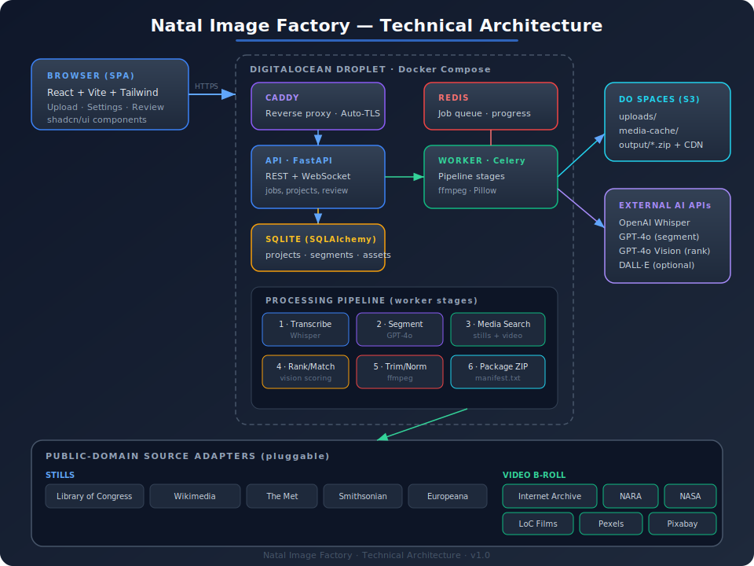

# Natal Image Factory — Technical Implementation Plan

**Version 1.0 · June 2026 · Internal engineering document**

This plan covers the **complete system**, including both **still images** and **public-domain video b-roll**. It builds on the client-approved [Design Overview](./Design-Overview.md), the [DigitalOcean Cost Analysis](./DigitalOcean-Cost-Analysis.md) (recommended: single Droplet + Spaces, ~$17/mo), and the video-extension discussion.

---

## 1. Architecture Overview



The system is a containerized monolith-plus-worker deployed via **Docker Compose** on a single DigitalOcean Droplet, with **Spaces** (S3-compatible) for file storage and external AI APIs for transcription, segmentation, and ranking. This keeps the idle cost flat and predictable while remaining fully portable to any Docker host.

### 1.1 Component Summary

| Component | Technology | Responsibility |
|---|---|---|
| **Web SPA** | React 18 + Vite + TailwindCSS + shadcn/ui | Upload, settings, live progress, review/swap, download |
| **Reverse proxy** | Caddy 2 | TLS (auto Let's Encrypt), routing, static asset serving |
| **API** | Python 3.12 + FastAPI + Uvicorn | REST endpoints, WebSocket progress, auth, job orchestration |
| **Worker** | Celery | Long-running pipeline stages (transcribe → segment → search → trim → package) |
| **Queue/broker** | Redis 7 | Celery broker + result backend + progress pub/sub |
| **Database** | SQLite via SQLAlchemy 2.x + Alembic | Projects, segments, assets, settings, source catalog |
| **Object storage** | DigitalOcean Spaces (boto3) | Uploaded audio/text, media cache, output ZIPs |
| **Media tooling** | ffmpeg, ffprobe, Pillow | Video probe/trim/normalize, image resize/validate |

### 1.2 Why This Shape

- **Single Droplet + Compose** matches the single-user, bursty workload and the $17/mo recommendation. The same `docker-compose.yml` runs locally, on the Droplet, or on any other host — satisfying "run anywhere."
- **ffmpeg requires full OS control** — this is a decisive reason to favor the Droplet over App Platform/Functions (confirmed in the cost analysis).
- **SQLAlchemy + Alembic over SQLite** means a one-line config change migrates to managed PostgreSQL if multi-user support is ever needed.

---

## 2. Technology Stack & Key Libraries

### Backend (Python)
```
fastapi, uvicorn[standard]      # API + ASGI server
celery[redis], redis            # background jobs
sqlalchemy, alembic             # ORM + migrations
boto3                           # Spaces (S3) client
openai                          # Whisper + GPT-4o + DALL·E
httpx, tenacity                 # async source API calls + retries
ffmpeg-python                   # ffmpeg wrapper (video trim/normalize)
pillow                          # image validation/resize
pydantic, pydantic-settings     # schema + config from env
python-multipart                # file uploads
```

### Frontend (Node)
```
react, react-dom, vite
tailwindcss, shadcn/ui, lucide-react
@tanstack/react-query           # API state
zustand                         # local UI state
wavesurfer.js                   # audio waveform + segment scrubbing
```

### System
```
ffmpeg / ffprobe   (apt package, baked into worker image)
caddy 2            (container)
```

---

## 3. Data Model

SQLAlchemy entities (SQLite tables). All large binaries live in Spaces; the DB stores only metadata and Spaces keys.

```
User
  id, email, password_hash, created_at

Project
  id, user_id, name, status            # draft|processing|review|complete|error
  media_mix, visual_style              # see §5
  ai_images_enabled, ai_video_motion   # Ken Burns / map-motion toggle
  source_audio_key, source_text_key    # Spaces keys
  audio_duration_s, created_at, updated_at

Segment
  id, project_id, index
  start_s, end_s, duration_s
  theme_label, summary                 # from GPT-4o
  search_query                         # generated keyword/semantic query
  chosen_media_type                    # still|video
  chosen_asset_id (FK Asset)

Asset                                  # a candidate or chosen media item
  id, segment_id, media_type           # still|video
  source_name, source_url, license     # provenance + license string
  attribution, thumbnail_key
  spaces_key                           # cached/processed file in Spaces
  width, height, duration_s            # duration_s null for stills
  relevance_score, is_chosen
  status                               # candidate|downloaded|processed|failed

SourceAdapterConfig
  id, user_id, source_name, media_type
  enabled, priority                    # user-preferred sources + ordering

Job
  id, project_id, stage, progress_pct, message, error, updated_at
```

---

## 4. Processing Pipeline (Worker Stages)

Each project runs through six idempotent, resumable Celery stages. Progress is published to Redis and streamed to the SPA via WebSocket.

### Stage 1 — Transcribe & Align
- Send uploaded audio to **OpenAI Whisper API** (`verbose_json`, word/segment timestamps).
- Produce a word-level timeline. Store transcript.
- *Self-hosted alternative:* `faster-whisper` on the Droplet (no per-use cost; needs more RAM/CPU — flagged for later).

### Stage 2 — Semantic Segmentation
- Feed the **article text** + **Whisper transcript** to **GPT-4o** with a structured prompt: divide narration into thematic segments aligned to natural topic shifts.
- Output (JSON): ordered segments with `start_s`, `end_s`, `theme_label`, `summary`, and a `search_query`.
- Article text anchors topics; transcript anchors **exact timestamps**. Reconcile so boundaries snap to sentence/clause edges in the audio.
- Persist `Segment` rows.

### Stage 3 — Media Search (Stills + Video)
- For each segment, the **Media Acquisition Layer** (§6) queries enabled source adapters in priority order.
- The **media type queried per segment is decided by the Media Mix policy** (§5): stills-only, video-only, or both (then ranked together).
- Collect N candidate `Asset` rows per segment (metadata + thumbnail only — no full download yet).

### Stage 4 — Rank & Match
- Score candidates for each segment using **GPT-4o Vision** on thumbnails + metadata against the segment `summary` and `visual_style`.
- Tie-breakers: license cleanliness, resolution, source priority, and (for video) duration adequacy vs. segment length.
- Mark the top candidate `is_chosen`. In **AI Judgement** mix mode, the cross-type score also decides still-vs-video per segment.
- If no candidate clears a quality threshold and AI generation is enabled → enqueue **DALL·E** (still) or **AI motion-on-still** (Ken Burns) fallback.

### Stage 5 — Acquire, Trim & Normalize
- **Download** chosen assets to a temp dir, then push processed results to Spaces `media-cache/`.
- **Stills:** validate, convert to a common format (JPG/PNG), optionally apply Ken Burns motion (§7) producing a short MP4 if requested.
- **Video:** the heart of the b-roll feature (§7) — probe, extract the relevant sub-clip, trim to segment duration, strip audio, normalize resolution/fps/codec.

### Stage 6 — Package
- Assemble the **mixed-media output package** (§8): sequentially numbered files + `manifest.txt`.
- Zip, upload to Spaces `output/`, generate a CDN download URL, set project `status = complete`.

---

## 5. Media Mix — Settings & Policy

New project-level setting (extends the existing visual-style picker from the Design Overview).

| `media_mix` value | Stage 3 query behavior | Stage 4 selection behavior |
|---|---|---|
| `stills` | Query still adapters only | Best still per segment |
| `video` | Query video adapters only; stills as fallback | Best video; still only if no usable clip |
| `balanced` | Query both | Enforce a target ratio + avoid 3 same-type segments in a row (keeps output dynamic) |
| `ai_judgement` | Query both | Cross-type vision score decides per segment (static topic → still; motion/process/journey → video) |

Additional toggles:
- **`ai_images_enabled`** — allow DALL·E fallback for stills (from original design).
- **`ai_video_motion`** — allow "Motion from Stills" (Ken Burns / animated maps) even in stills-heavy modes (§7.3).
- **Per-segment override** in the Review UI: force still↔video, which re-runs Stages 3–5 for that one segment only.

---

## 6. Media Acquisition Layer (Pluggable Adapters)

A common interface so stills and video sources are added without touching the pipeline.

```python
class SourceAdapter(Protocol):
    name: str
    media_type: Literal["still", "video"]
    license_default: str
    async def search(self, query: str, *, style: str, min_duration_s: float | None,
                     limit: int) -> list[CandidateAsset]: ...
    async def fetch(self, asset: CandidateAsset, dest: Path) -> Path: ...
```

### 6.1 Still Adapters (from approved design)
Library of Congress, Wikimedia Commons, The Met (Open Access API), Smithsonian Open Access, Europeana, Unsplash.

### 6.2 Video Adapters (new)
| Adapter | API / Method | Notes |
|---|---|---|
| **Internet Archive / Prelinger** | `archive.org` advancedsearch + metadata API | Largest public-domain film trove; historic newsreels — ideal for the Daniel Natal Show's geopolitical/historical content |
| **U.S. National Archives (NARA)** | NARA Catalog API | Government/military footage, public domain by default |
| **Library of Congress — Films** | LoC `loc.gov` JSON API | Early American/event film |
| **NASA / NOAA** | NASA Image & Video Library API | Space/science/earth footage |
| **Wikimedia Commons (video)** | Same API, `filetype:video` | Mixed educational clips |
| **Pexels / Pixabay / Coverr** | Public stock video APIs | Modern, clean B-roll for contemporary topics |

### 6.3 Adapter Rules
- Every returned candidate **must** carry a machine-readable license + attribution; assets without a confirmable public-domain/open license are discarded.
- Adapters are **rate-limited** (`tenacity` backoff) and **cached** in Spaces `media-cache/` keyed by source+id to avoid re-downloading across projects.
- **Self-curated discovery:** a periodic task can expand the default source list (from the design doc) — implemented as adding new adapters; the catalog table tracks enablement/priority.

---

## 7. Video Processing (The B-Roll Engine)

The technically novel part. All operations via `ffmpeg`/`ffprobe` inside the worker container.

### 7.1 Duration-Aware Fitting
Each segment has a fixed duration `D = end_s - start_s`. For a chosen clip of length `L`:

| Condition | Action |
|---|---|
| `L >= D` | **Sub-clip extraction:** pick the most relevant `D`-second window (default: from a metadata-suggested or mid-point start), trim to exactly `D` |
| `L < D` (slightly) | Slow-motion `setpts` or boomerang loop to reach `D` |
| `L << D` | **Multi-clip fill:** sequence several shorter clips to cover `D` (each gets `Vid_NN_a`, `_b` suffixes) |

### 7.2 Normalization (consistent editor timeline)
- Container/codec: `MP4 / H.264 (yuv420p)`, configurable target (e.g., 1920×1080, 30fps).
- **Strip original audio** (`-an`) — Daniel's voiceover is the only audio track.
- Letterbox/scale to target aspect ratio without distortion (`scale` + `pad`).
- Example: `ffmpeg -ss {start} -i in.mp4 -t {D} -an -vf "scale=1920:1080:force_original_aspect_ratio=decrease,pad=1920:1080:(ow-iw)/2:(oh-ih)/2,fps=30" -c:v libx264 -pix_fmt yuv420p out.mp4`

### 7.3 "Motion from Stills" (signature feature)
- **Ken Burns:** slow pan/zoom on a still via `zoompan`, producing a `D`-second MP4 — cinematic motion without sourcing video.
- **Animated maps:** zoom/pan into a region of a high-res historic map; optional highlight overlay. Great for historical/geopolitical storytelling.
- Controlled by `ai_video_motion`; can apply even in `stills` mix mode.

### 7.4 Resource Guardrails
- Cap concurrent ffmpeg jobs (worker concurrency = 1–2 on a 2 GiB Droplet) to avoid OOM.
- Stream-download large source films to temp, extract sub-clip, **delete the full file immediately** to conserve disk; only the trimmed clip persists to Spaces.

---

## 8. Output Package Format

A single ZIP in Spaces `output/`, downloadable via CDN URL. Mixed media, sequentially numbered for drag-and-drop into any editor.

```
Img_01_roman_map.jpg
Vid_02_legion_march.mp4
Img_03_colosseum_lithograph.jpg
Vid_04a_fall_of_rome.mp4
Vid_04b_sack_of_rome.mp4
manifest.txt
attributions.txt
```

`manifest.txt` (supersedes `timestamps.txt`; timestamps stay in the file, not the filenames, per the original design):
```
# index | type  | start  | end    | dur   | theme                         | source
Img_01  | STILL | 0:00   | 1:42   | 1:42  | Origins of the Roman Empire   | Library of Congress
Vid_02  | VIDEO | 1:42   | 3:55   | 2:13  | Military expansion in Europe  | Internet Archive
Img_03  | STILL | 3:55   | 5:10   | 1:15  | Art & architecture of Rome    | The Met
Vid_04a | VIDEO | 5:10   | 6:30   | 1:20  | The decline begins            | NARA
Vid_04b | VIDEO | 6:30   | 7:38   | 1:08  | The sack of Rome              | Internet Archive
```

`attributions.txt` lists full license + credit per asset (legal safety from the design doc).

---

## 9. API Surface (FastAPI)

| Method & Path | Purpose |
|---|---|
| `POST /auth/login` | Session/JWT auth |
| `POST /projects` | Create project (name, settings) |
| `POST /projects/{id}/uploads/text` | Upload/paste article (→ Spaces) |
| `POST /projects/{id}/uploads/audio` | Upload voiceover (multipart → Spaces) |
| `PATCH /projects/{id}/settings` | media_mix, visual_style, sources, toggles |
| `POST /projects/{id}/generate` | Enqueue pipeline |
| `WS /projects/{id}/progress` | Live stage/progress stream |
| `GET /projects/{id}/segments` | Review data (segments + chosen assets + alternates) |
| `POST /segments/{id}/swap` | Override media type / pick alternate (re-runs 3–5 for one segment) |
| `GET /projects/{id}/download` | Signed Spaces CDN URL for the ZIP |
| `GET/PUT /settings/sources` | Manage preferred source adapters + priority |

---

## 10. Deployment & Infrastructure

### 10.1 Docker Compose Topology
```
services:
  caddy     # 80/443, TLS, proxy → api, serves built SPA
  api       # FastAPI (uvicorn)
  worker    # Celery (image includes ffmpeg)
  redis     # broker + progress
  # SQLite file on a Docker volume; Spaces via env creds
volumes: { db_data, caddy_data }
```

### 10.2 DigitalOcean Resources (per cost analysis)
- **Droplet:** 2 GiB / 1 vCPU / 50 GiB ($12/mo); resize to 4 GiB/2 vCPU if video volume grows.
- **Spaces:** 250 GiB + 1 TiB CDN transfer ($5/mo) — buckets/prefixes: `uploads/`, `media-cache/`, `output/`.
- **Backups:** weekly Droplet snapshots (~$2.40/mo) + SQLite file is in a backed-up volume.

### 10.3 Config & Secrets (12-factor, `.env` / DO env vars)
```
OPENAI_API_KEY=...
SPACES_KEY=... SPACES_SECRET=... SPACES_REGION=... SPACES_BUCKET=...
PEXELS_API_KEY=... PIXABAY_API_KEY=... UNSPLASH_ACCESS_KEY=...
DATABASE_URL=sqlite:////data/app.db     # swap to postgresql:// later
REDIS_URL=redis://redis:6379/0
```
Secrets never committed; injected at runtime. API keys flagged to the client as a cost/ownership item.

### 10.4 CI/CD
- GitHub Actions: lint + test → build images → push to DO Container Registry (free tier) → `ssh` deploy / `docker compose pull && up -d` on the Droplet.

---

## 11. Security & Compliance

- **License enforcement** at the adapter layer — discard anything not confirmably public-domain/open; persist license string + attribution per asset.
- **Auth:** single-tenant now (hashed password, JWT); schema already multi-user ready.
- **Input limits:** max audio size/duration, allowed mime types, virus/size guards on upload.
- **Secrets management** via env; least-privilege Spaces key.
- **AI content labeling:** AI-generated assets tagged in the manifest for transparency.

---

## 12. Phased Roadmap

| Phase | Scope | Outcome |
|---|---|---|
| **0 — Scaffolding** | Repo, Docker Compose, Caddy, FastAPI/Celery/Redis/SQLite skeleton, Spaces wiring, auth | Deployable empty shell on the Droplet |
| **1 — Stills MVP** | Upload → Whisper → GPT-4o segmentation → still adapters (LoC, Wikimedia, Met) → rank → ZIP + manifest | End-to-end **image** product (matches approved design) |
| **2 — Review UI** | SPA review screen: waveform, segment timeline, swap/alternates, live progress | Client can curate before export |
| **3 — Video B-Roll** | Video adapters (Internet Archive, NARA, NASA, Pexels), ffmpeg trim/normalize, duration-aware fitting, mixed-media manifest | **Stills + video** product |
| **4 — Media Mix & Motion** | media_mix policy modes, per-segment override, Ken Burns / animated maps | Full creative control |
| **5 — Hardening** | Source-discovery expansion, caching, rate-limit/retry polish, backups, monitoring, cost telemetry | Production-ready |

*(Phases are sequenced by dependency, not dated — timeline to be set with the client.)*

---

## 13. Testing Strategy

- **Unit:** segmentation reconciliation (transcript↔article), duration-fitting math, manifest formatting, adapter license parsing.
- **Adapter contract tests:** recorded HTTP fixtures (`respx`) per source so API changes are caught.
- **ffmpeg integration tests:** trim/normalize on sample clips; assert output duration == segment duration, audio stripped, target resolution/fps.
- **Pipeline e2e:** a short sample article + 60-second voiceover run through all 6 stages in CI against mocked AI + recorded source responses.
- **Frontend:** Playwright flow — create project → upload → generate (mocked) → review → swap → download.

---

## 14. Cost Summary

| Item | Cost | Notes |
|---|---|---|
| Droplet (2 GiB) | $12/mo | Resize path available |
| Spaces | $5/mo | 250 GiB + 1 TiB CDN |
| Backups | ~$2.40/mo | Optional snapshots |
| **DigitalOcean total** | **~$17–19/mo** | Flat, predictable |
| OpenAI (Whisper + GPT-4o + vision) | ~$0.20–$1.00 / project | Separate, pay-per-use |
| AI image gen (optional) | ~$0.02–$0.08 / image | Only when enabled |
| Stock video APIs (Pexels/Pixabay) | Free tier | Archive/NARA/NASA/LoC free |

Video adds **storage/bandwidth**, not meaningful AI cost (matching is metadata + thumbnail based). Well within Spaces allowances at low volume.

---

*Natal Image Factory · Technical Implementation Plan · v1.0*
