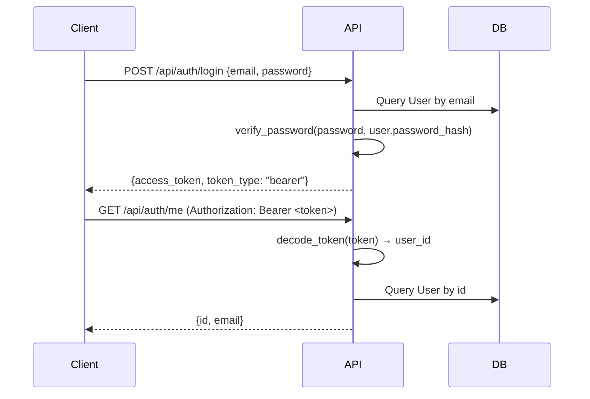

# Authentication

## JWT-based auth flow

## Implementation

- **Password hashing**: `backend/app/security.py` uses `passlib[bcrypt]==1.7.4` with `bcrypt==4.0.1` pinned. `hash_password(plain)` → bcrypt hash. `verify_password(plain, hash)` → bool.
- **JWT**: `python-jose` with HS256 algorithm. `create_access_token(subject)` encodes `{"sub": user_id, "exp": ...}`. `decode_token(token)` returns the subject or raises.
- **Token expiry**: 30 days (configurable via `ACCESS_TOKEN_EXPIRE_MINUTES`).
- **Dependency**: `get_current_user` in `backend/app/deps.py` extracts the Bearer token from the Authorization header, decodes it, and returns the User from DB. Raises `401` on failure.

## Bootstrap User

On startup, `main.py` calls `_bootstrap_user()` which checks if any users exist. If the `users` table is empty and `BOOTSTRAP_USER_EMAIL` / `BOOTSTRAP_USER_PASSWORD` are set in env, it creates the initial admin user. This is idempotent — only runs when the table is empty.

## Invariants

- All protected routes use `Depends(get_current_user)`.
- Tokens are stateless — no revocation mechanism (Phase 2+).
- Password hashes use bcrypt (72-byte max input — `bcrypt==4.0.1` enforces this).
