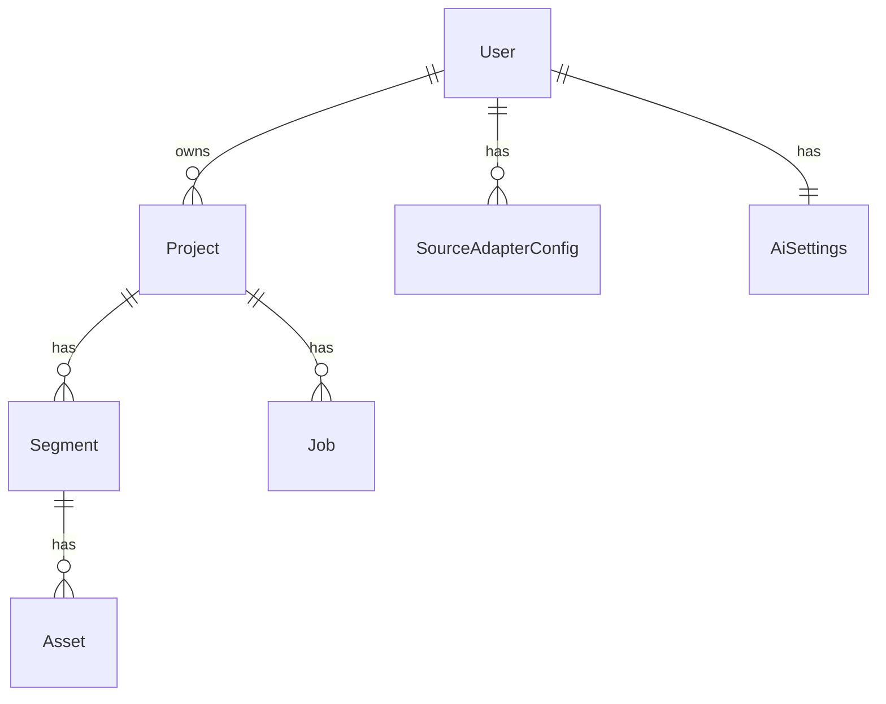

# ORM Models

All models are in `backend/app/models.py` using SQLAlchemy 2.0 typed style (`Mapped[T]`, `mapped_column()`).

## Enums

- **ProjectStatus**: `draft` → `processing` → `review` → `complete` | `error`
- **MediaMix**: `stills`, `video`, `balanced`, `ai_judgement`
- **MediaType**: `still`, `video`
- **AssetStatus**: `candidate` → `downloaded` → `processed` | `failed`
- **AiProvider**: `openai`, `anthropic`, `gemini`, `deepseek`

## Models

### User
- `id`, `email` (unique, indexed), `password_hash`, `created_at`
- Relationship: `projects` (cascade delete)

### Project
- `id`, `user_id` (FK), `name`, `status` (ProjectStatus)
- Settings: `media_mix`, `visual_style` (default "ai_judgement"), `ai_images_enabled`, `ai_video_motion`
- Sources: `source_audio_key`, `source_text_key` (Spaces keys), `audio_duration_s`
- Timestamps: `created_at`, `updated_at`
- Relationships: `user`, `segments` (ordered by index), `jobs`

### Segment
- `id`, `project_id` (FK), `index` (ordering)
- Timeline: `start_s`, `end_s`, `duration_s`
- AI output: `theme_label`, `summary`, `search_query`
- Selection: `chosen_media_type` (MediaType), `chosen_asset_id` (FK to Asset, nullable)
- Relationships: `project`, `assets`

### Asset
- `id`, `segment_id` (FK), `media_type` (MediaType)
- Source: `source_name`, `source_url`, `license`, `attribution`
- Storage: `thumbnail_url` (source thumbnail URL), `thumbnail_key`, `spaces_key` (Spaces object keys)
- Dimensions: `width`, `height`, `duration_s`
- Ranking: `relevance_score`, `is_chosen`, `status` (AssetStatus)
- Relationship: `segment`

### SourceAdapterConfig
- `id`, `user_id` (FK), `source_name`, `media_type`, `enabled`, `priority`
- Per-user configuration for which source adapters are active and their priority order.

### AiSettings
- `id`, `user_id` (FK, unique), `provider`, `model`, `vision_model`, `image_model`
- Global per-user AI provider/model selection used by pipeline stages.

### Job
- `id`, `project_id` (FK), `stage`, `progress_pct`, `message`, `error`, `updated_at`
- Tracks pipeline execution progress per stage.

## Invariants

- `Segment.index` is ordered — segments are always retrieved ordered by index.
- `Asset.is_chosen` and `Segment.chosen_asset_id` must be consistent when a selection is made.
- `Project.status` transitions: `draft` → `processing` → `review` → `complete` (or `error` at any point).
- `SourceAdapterConfig.priority` is ascending (lower = higher priority).
