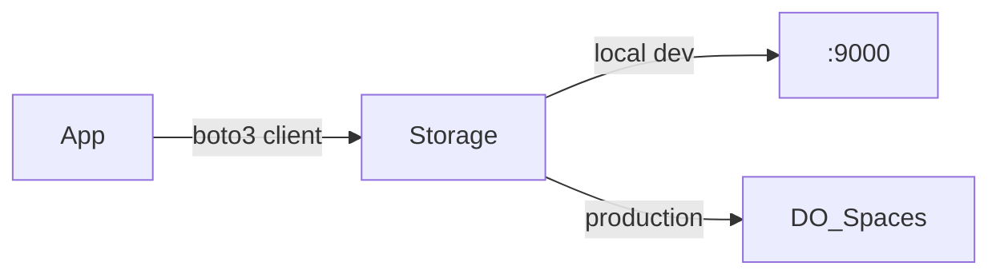

# Object Storage

## S3-Compatible Storage

`backend/app/storage.py` wraps `boto3` to provide S3-compatible operations that work with both MinIO (local dev) and DigitalOcean Spaces (production).

## Configuration

- `SPACES_ENDPOINT_URL` — `http://minio:9000` (local) or `https://<region>.digitaloceanspaces.com` (prod)
- `SPACES_PUBLIC_URL` — `http://localhost:9000/natal-media` (local) or `https://<bucket>.<region>.cdn.digitaloceanspaces.com` (prod)
- `SPACES_KEY` / `SPACES_SECRET` — Access credentials
- `SPACES_BUCKET` — `natal-media` (default)

## Operations

- `ensure_bucket()` — Creates the bucket if it doesn't exist (called on startup, errors suppressed).
- `upload_bytes(key, data, content_type)` — Uploads raw bytes to a key.
- `upload_fileobj(key, fileobj, content_type)` — Uploads a file-like object.
- `download_bytes(key)` — Returns bytes for a given key.
- `presigned_url(key, expires)` — Generates a temporary download URL.
- `public_url(key)` — Returns the public URL for a key (if bucket is public).

## Key Conventions

- Uploaded source files: `uploads/{project_id}/{filename}`
- Processed media: `media/{project_id}/{segment_index}_{asset_id}.{ext}`
- Output ZIPs: `output/project_{project_id}.zip`
- Thumbnails: `thumbs/{project_id}/{asset_id}.jpg`

## Invariants

- The bucket name is `natal-media` by default.
- `ensure_bucket()` is called on startup but failures are suppressed — the app starts even if storage is unavailable.
- All file uploads go through the API (not directly to S3) to enforce auth and validation.
