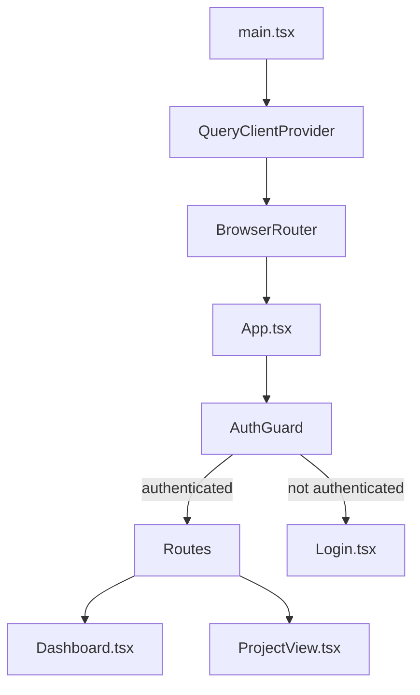

# Frontend Architecture

## Component Tree

## API Communication

- `api.ts` exports an Axios instance with base URL `/api` (Vite proxy in dev, Caddy proxy in prod).
- Request interceptor adds JWT from `localStorage.getItem("token")`.
- 401 responses clear the token and redirect to login (not yet implemented — Phase 1).

## Vite Configuration

- Dev server runs on `host: true, port: 5173`.
- Proxy: `/api` → `http://localhost:8000` (for local `npm run dev` without Docker).
- Proxy: `/ws` → `http://localhost:8000` (WebSocket for progress).

## State Management

- **Server state**: `@tanstack/react-query` (QueryClient in `main.tsx`). Used for fetching projects, segments.
- **Client state**: `zustand` listed in dependencies but not yet used. Will be added for project settings form state in Phase 1.
- **Auth state**: JWT stored in `localStorage`, checked by `App.tsx` auth guard.

## Styling

- TailwindCSS with PostCSS. Config in `tailwind.config.js` and `postcss.config.js`.
- Custom color palette extension in Tailwind config (slate/amber/zinc).
- shadcn/ui listed in dependencies but not yet installed/configured.

## Invariants

- Build script is `vite build` only (no `tsc -b`) to avoid blocking Docker builds.
- Frontend Dockerfile build context is the repo root (copies `Caddyfile` from root).
- All API routes are under `/api/*` — the FastAPI app uses `root_path="/api"`.
