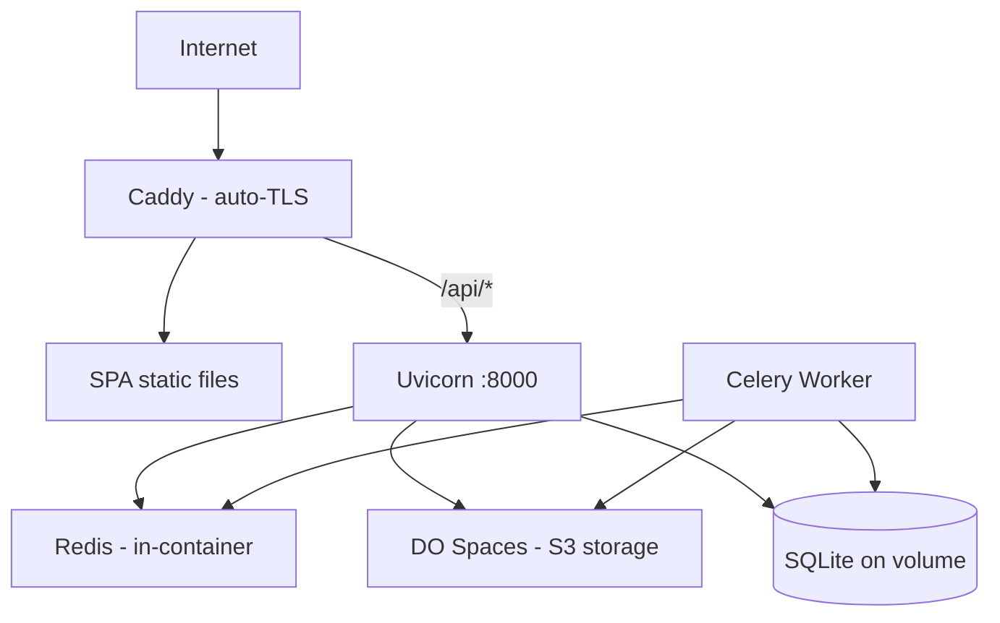

# DigitalOcean Deployment

## Target Architecture

## Cost Analysis

| Resource | Cost | Notes |
|----------|------|-------|
| DO Droplet (2 vCPU, 4GB) | $12/mo | Runs all containers |
| DO Spaces (250GB + 1TB transfer) | $5/mo | S3-compatible object storage |
| **Total infrastructure** | **$17/mo** | |
| AI API costs (per project) | $0.20–$1.00 | OpenAI Whisper + GPT-4o (separate) |

## Deployment Steps (Phase 4)

1. Provision a DO Droplet with Docker pre-installed.
2. Create a DO Spaces bucket (`natal-media`).
3. Clone the repo, create `.env` with production secrets.
4. Run `docker compose -f docker-compose.yml -f docker-compose.prod.yml up -d`.
5. Point DNS to the Droplet IP. Caddy auto-provisions TLS certificates.
6. Configure firewall: open ports 80 and 443 only.

## Key Decisions

- **Droplet over App Platform**: App Platform container-second pricing is expensive for always-on services. Droplet offers predictable monthly pricing.
- **Droplet over DOKS**: Kubernetes is overkill for a single-user, low-traffic application.
- **SQLite over managed PostgreSQL**: For a single-user app, SQLite on a volume is sufficient. Managed PostgreSQL starts at $15/mo — nearly doubling infrastructure cost. Can migrate later if needed.
- **DO Spaces over local storage**: S3-compatible, CDN-backed, and required for media persistence across container rebuilds.
