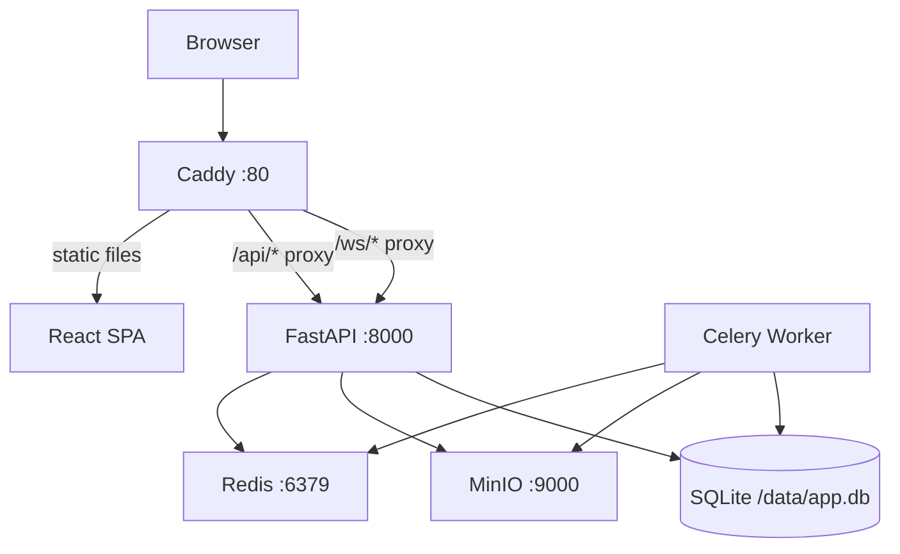

# Infrastructure Summary

## Local Development Stack

## Services (docker-compose.yml)

| Service | Image/Build | Port | Purpose |
|---------|------------|------|---------|
| `web` | Built from `frontend/Dockerfile` | 80 | Caddy serving SPA + reverse proxy |
| `api` | Built from `backend/Dockerfile` | 8000 | FastAPI application |
| `worker` | Built from `backend/Dockerfile` | — | Celery worker |
| `redis` | `redis:7-alpine` | — | Message broker + pub/sub |
| `minio` | `minio/minio:latest` | 9000, 9001 | S3-compatible storage |

## Volumes

- `db_data` — SQLite database, shared between `api` and `worker`
- `minio_data` — MinIO object storage

See: [docker-compose.md](docker-compose.md), [deployment.md](deployment.md)
