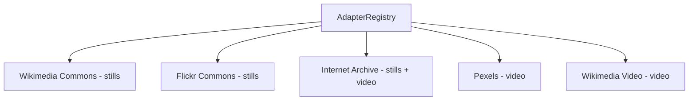

# Source Adapters

## Protocol

Defined in `backend/app/pipeline/adapters/base.py`:

```python
@dataclass
class CandidateAsset:
    media_type: MediaType          # still or video
    source_name: str               # e.g. "wikimedia"
    source_url: str                # original URL
    thumbnail_url: str | None
    license: str | None
    attribution: str | None
    width: int | None
    height: int | None
    duration_s: float | None       # video only

class SourceAdapter(Protocol):
    name: str
    media_type: MediaType

    async def search(
        self,
        query: str,
        visual_style: str,
        max_results: int = 10,
    ) -> list[CandidateAsset]: ...
```

## Planned Adapters



## Source Adapter Config

Users can configure which adapters are enabled and their priority via the `/api/sources` router. Configurations are stored in the `SourceAdapterConfig` table per user.

- `source_name` — matches the adapter's `name` attribute
- `media_type` — `still` or `video`
- `enabled` — bool toggle
- `priority` — ascending (lower = higher priority)

## Default Catalog

The `sources.py` router returns a curated default catalog of available sources when no user-specific config exists. This catalog includes Wikimedia Commons, Flickr Commons, Internet Archive, and Pexels.

## Invariants

- All adapters must implement the `SourceAdapter` protocol.
- Adapters return `CandidateAsset` objects — the pipeline converts these to `Asset` DB records.
- Media mix policy is enforced at the search stage: if `media_mix == stills`, only still adapters are queried; if `video`, only video; if `balanced`, both are queried with equal priority; if `ai_judgement`, the AI decides based on segment content.
